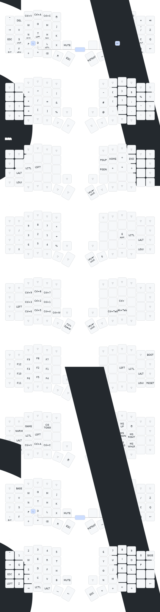

# Sofle RGB Keymap

This is my [Quantum Mechanical Keyboard (QMK)](https://docs.qmk.fm/) keymap for Sofle RGB keyboard. This repo works as an [External QMK Userspace](https://docs.qmk.fm/newbs_external_userspace).

The base layer is [Hands Down Promethium (Inverted) Layout](https://www.reddit.com/r/KeyboardLayouts/comments/1g66ivi/hands_down_promethium_snth_meets_hd_silverengram/).



## Installation

1. Set up your QMK environment by following the [QMK documentation](https://docs.qmk.fm/#/newbs/getting_started).
1. Clone this repository.
1. Set this repository as overlay
   ```bash
   qmk config user.overlay_dir="$(realpath qmk_userspace)"
   ```
1. Compile the keymap
   ```bash
   qmk compile -kb sofle/rev1 -km hasssan
   ```

## Creating the visualization

1. Install [Keymap Drawer](https://github.com/caksoylar/keymap-drawer) CLI.
1. Run one of the following commands to create the keymap and SVG visualization.
    - Create a new keymap file:
        ```bash
        keymap \
            -c assets/keymap-drawer-config.yml parse \
            -b assets/keymap-drawer-base-keymap.yml \
            -q assets/sofle_rev1_hasssan.json \
            --layer-names BASE SYM NAV NUM WIN FUN EXT NHRM GAME \
            -o assets/keymap-drawer-keymap.yml
        ```
    - Create a new keymap drawer SVG:
        ```bash
        keymap \
            -c assets/keymap-drawer-config.yml parse \
            -b assets/keymap-drawer-base-keymap.yml \
            -q assets/sofle_rev1_hasssan.json \
            --layer-names BASE SYM NAV NUM WIN FUN EXT NHRM GAME \
            | keymap \
            -c assets/keymap-drawer-config.yml draw - assets/keymap-drawer-combos.yml \
            -o assets/keymap-drawer.svg
        ```
    - Combine the above two commands:
        ```bash
        keymap \
            -c assets/keymap-drawer-config.yml parse \
            -b assets/keymap-drawer-base-keymap.yml \
            -q assets/sofle_rev1_hasssan.json \
            --layer-names BASE SYM NAV NUM WIN FUN EXT NHRM GAME \
            -o assets/keymap-drawer-keymap.yml \
            && keymap \
            -c assets/keymap-drawer-config.yml parse \
            -b assets/keymap-drawer-base-keymap.yml \
            -q assets/sofle_rev1_hasssan.json \
            --layer-names BASE SYM NAV NUM WIN FUN EXT NHRM GAME \
            | keymap \
            -c assets/keymap-drawer-config.yml draw - assets/keymap-drawer-combos.yml \
            -o assets/keymap-drawer.svg
        ```
    - Watch for changes in the keymap file and run the combined command above, using [Nodemon](https://nodemon.io/):
        ```bash
        nodemon -e yaml,yml --ignore keymap-drawer-keymap.yml --exec 'keymap -c assets/keymap-drawer-config.yml parse -b assets/keymap-drawer-base-keymap.yml -q assets/sofle_rev1_hasssan.json --layer-names BASE SYM NAV NUM WIN FUN EXT NHRM GAME -o assets/keymap-drawer-keymap.yml && keymap -c assets/keymap-drawer-config.yml parse -b assets/keymap-drawer-base-keymap.yml -q assets/sofle_rev1_hasssan.json --layer-names BASE SYM NAV NUM WIN FUN EXT NHRM GAME | keymap -c assets/keymap-drawer-config.yml draw - assets/keymap-drawer-combos.yml -o assets/keymap-drawer.svg'
        ```

## Credits

- Heavily inspired by [getreuer/qmk-keymap](https://github.com/getreuer/qmk-keymap/).
- Original [Sofle default keymap](https://github.com/qmk/qmk_firmware/blob/master/keyboards/sofle/keymaps/default/keymap.c)
- Excelent visualization [Keymap Drawer](https://github.com/caksoylar/keymap-drawer).
